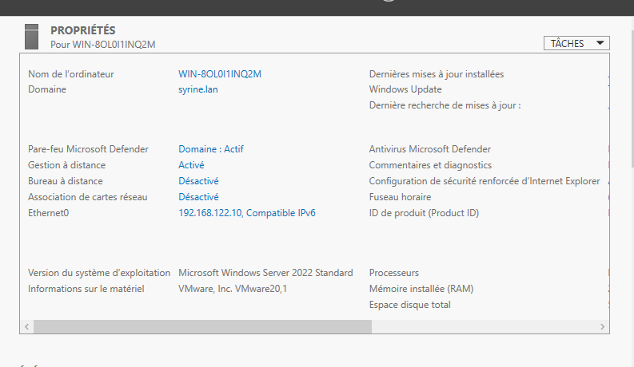
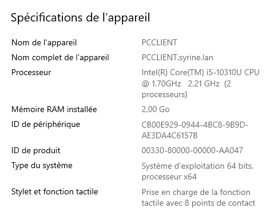
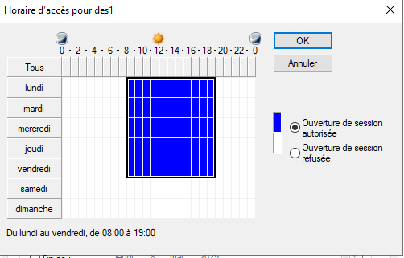
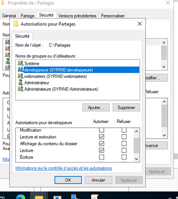
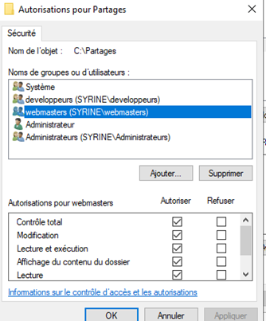
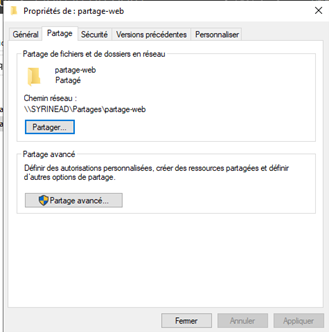

#  Infrastructure Réseau Complète - Active Directory, Apache & DHCP


##  Table des matières
- [Présentation du projet](#-présentation-du-projet)
- [Architecture technique](#-architecture-technique)
- [Partie 1 : Active Directory](#-partie-1--active-directory)
  - [Installation du serveur](#installation-du-serveur)
  - [Création des UO et groupes](#création-des-uo-et-groupes)
  - [Gestion des utilisateurs](#gestion-des-utilisateurs)
  - [Stratégies de groupe (GPO)](#stratégies-de-groupe-gpo)
  - [Dossiers partagés](#dossiers-partagés)
- [Partie 2 : Services Réseau](#-partie-2--services-réseau)
  - [Serveur DHCP](#serveur-dhcp)
  - [Serveur DNS](#serveur-dns)
- [Partie 3 : Serveur Web Apache](#-partie-3--serveur-web-apache)
  - [Site web www.syrine.lan (HTTPS)](#site-web-wwwsyrinelan-https)
  - [Intranet sur port 8080](#intranet-sur-port-8080)
  - [Accès FTP](#accès-ftp)
- [Scripts d'automatisation](#-scripts-dautomatisation)
- [Prérequis](#-prérequis)
- [Structure du projet](#-structure-du-projet)
- [Auteure](#-auteure)

##  Présentation du projet

Ce projet consiste à déployer une infrastructure réseau complète pour une entreprise, avec **3 machines virtuelles** :
-  **Serveur Windows 20xx** : Contrôleur de domaine Active Directory, DNS, DHCP
-  **Client Windows 10** : Poste de travail intégré au domaine
-  **Serveur Linux (Debian)** : Serveur web Apache avec sites web

### Objectifs atteints
 Mise en place d'un domaine Active Directory `syrine.lan`  
 Création d'utilisateurs et groupes avec droits spécifiques  
 Configuration de stratégies de groupe (GPO)  
 Déploiement d'un serveur DHCP avec étendue personnalisée  
 Configuration DNS avec zones directe et inversée  
 Installation d'Apache avec 2 sites (HTTPS et port 8080)  
 Mise en place d'accès FTP pour l'intranet  
 Scripts d'automatisation pour la création des utilisateurs  

---


---

##  Partie 1 : Active Directory

### Installation du serveur

**Serveur :** `SYRINEAD`  
**Domaine :** `syrine.lan`  
**IP :** `192.168.1.100`



### Création des UO et groupes

| UO | Groupes |
|-----|---------|
| **Utilisateurs** | developpeurs, webmasters, designers |


### Création des utilisateurs

| Groupe | Utilisateurs |
|--------|--------------|
| **developpeurs** | dev1, dev2 |
| **webmasters** | web1, web2 |
| **designers** | des1, des2 |

### Intégration du client au domaine

Le poste client `PCCLIENT` a été intégré au domaine `syrine.lan` :



### Stratégies de groupe (GPO)

#### 1. Restriction CMD pour les designers 

Les membres du groupe **designers** ne peuvent pas utiliser l'invite de commandes :


#### 2. Restrictions horaires pour des1 

L'utilisateur **des1** ne peut se connecter que :
- Du lundi au vendredi
- De 8h à 16h



### Dossiers partagés

#### Dossier partagé "partage-web" 

**Chemin :** `\\SYRINEAD\partage-web`  
**Droits :**
- Webmasters : Contrôle total
- Développeurs : Lecture seule





**Script de mappage automatique (lecteur X:) :**
```batch
net use X: \\SYRINEAD\partage-web /persistent:yes

---

##  Partie 2 : Services Réseau

### Serveur DHCP

**Configuration :**
- Étendue : 50 dernières adresses du réseau (192.168.1.206 à 192.168.1.254)
- Bail : 5 heures
- Passerelle : configurée
- DNS : envoyé aux clients


### Serveur DNS

**Zone de recherche inversée :**


**Entrées DNS :**
- `www.syrine.lan` → 192.168.1.100
- `intranet.syrine.lan` → 192.168.1.100


---

##  Partie 3 : Serveur Web Apache

### Configuration du serveur Linux

**Serveur :** Debian / Ubuntu  
**Services :** Apache2, vsftpd

### Site web www.syrine.lan (HTTPS)

- **URL :** `https://www.syrine.lan`
- **Port :** 443 (HTTPS)
- **Contenu :** "Bienvenue sur le site web www.syrine.lan"


### Intranet sur port 8080

- **URL :** `http://intranet.syrine.lan:8080`
- **Port :** 8080
- **Contenu :** "Bienvenue sur l'intranet intranet.syrine.lan"


### Accès FTP

L'accès FTP est configuré pour permettre la mise à jour du contenu de l'intranet :

- **Serveur :** ftp.syrine.lan
- **Dossier racine :** `/var/www/syrine.lan/intranet`


---

##  Scripts d'automatisation

### Scripts disponibles dans le dossier `scripts/`

| Script | Description |
|--------|-------------|
| `create-users.ps1` | Crée automatiquement tous les utilisateurs et groupes AD |
| `setup-gpos.ps1` | Configure les GPO (restrictions, mappages) |
| `map-drive.vbs` | Mappe le lecteur X: pour les webmasters |
| `map-w-drive.vbs` | Mappe le lecteur W: pour tous les utilisateurs |
| `logon.bat` | Script de connexion batch (alternative) |

### Exemple d'utilisation

```powershell
# Exécuter sur le contrôleur de domaine
.\scripts\create-users.ps1

---

##  Guide d'installation rapide

### Étape 1 : Serveur Windows (AD/DNS/DHCP)
1. Installer Windows Server
2. Configurer IP fixe (192.168.1.100)
3. Installer le rôle AD DS et promouvoir en contrôleur de domaine
4. Installer le rôle DHCP et configurer l'étendue
5. Créer les UO, groupes et utilisateurs (ou utiliser le script `create-users.ps1`)

### Étape 2 : Client Windows 10
1. Installer Windows 10
2. Configurer l'IP en DHCP
3. Intégrer au domaine `syrine.lan`
4. Tester les connexions (ping, accès aux partages, etc.)

### Étape 3 : Serveur Linux (Apache)
1. Installer Debian/Ubuntu
2. Installer Apache2 : `sudo apt install apache2 -y`
3. Configurer les VirtualHosts (fichiers dans `config/apache/`)
4. Générer un certificat SSL auto-signé pour HTTPS
5. Installer vsftpd : `sudo apt install vsftpd -y`
6. Configurer vsftpd avec le fichier `config/ftp/vsftpd.conf`

##  Auteure

**ABDELBASSET Syrine**  
Bachelor Cyber 1

##  Notes complémentaires

- Toutes les configurations ont été testées et fonctionnent dans un environnement de laboratoire
- Les scripts PowerShell nécessitent des droits d'administrateur Active Directory pour s'exécuter correctement
- Pour la partie HTTPS, un certificat auto-signé est utilisé (adapté pour un environnement de test uniquement)
- Les mots de passe par défaut des utilisateurs doivent être changés à la première connexion
- Pensez à adapter les adresses IP dans les fichiers de configuration si votre réseau NAT utilise une plage différente
